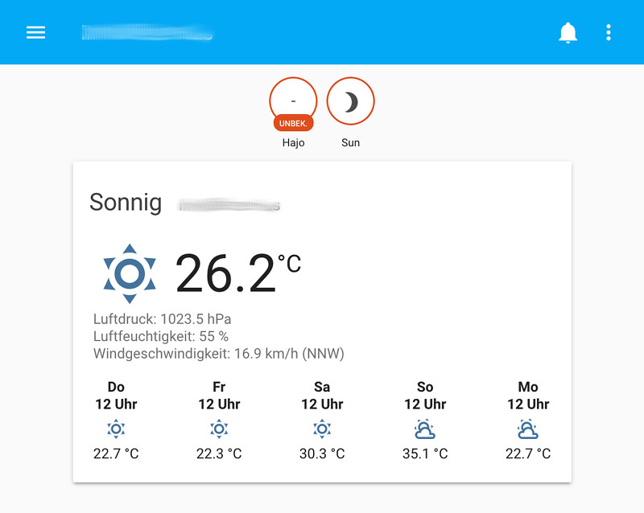

# Home Assistant

> [Hier](old/doc/homeassistant_install.md) steht die alte Beschreibung meiner manuellen Installation vor dem Umstieg auf Docker.

## Installation mit docker

Eine Beschreibung zur Installation von HomeAssistant-Docker-Containern findet sich [hier](https://www.home-assistant.io/docs/installation/docker/). Es wird davon ausgegangen, dass docker und docker-compose bereits installiert ist. Deshalb hier kurz die Installation von docker und docker-compose.

### Installation von docker und docker-compose
#### docker
Auf docker.com gibt es ein Skript zur Installation und zum Update von docker. Mit dem nachfolgenden Befehl läd man das Skript herunter und installiert docker. Der zweite Befehl ermöglicht, dass der User `pi` docker ausführen kann.
```
curl -sSL https://get.docker.com | sh
sudo usermod -aG docker pi
```
#### docker-compose
```
sudo pip3 install docker-compose
```

### Installation des HomeAssistant-Containers
**ACHTUNG:** Wenn man auf diese Weise einen Docker-Container herunter lädt und startet, führt dies zu einem Fehler, wenn man einen Container selben Namens mit docker-compose erstellt. Hier müsste dann der bestehende Container mit `docker rename /home-assistant /home-assistant-native-docker` umbenannt werden. Sollte der Container bereits laufen, muss mit `docker update 2aed9c29a1d0 --restart no` der Container auf kein restart gesetzt werden. Mit `docker stop 2aed9c29a1d0` wird der laufende Container gestoppt. Am Ende habe ich alles entfernt und erneut mit docker-compose begonnen.

```
docker run --init -d --name="home-assistant" -v /home/pi/homeassistant:/config -v /etc/localtime:/etc/localtime:ro --net=host homeassistant/raspberrypi3-homeassistant
```

Nach kurzer Zeit ist Home Assistant unter `http://192.168.178.111:8123` erreichbar.  


### docker-compose
Um nach dem booten oder nach einem Fehler HA automatisch neu zu starten, bietet sich der Start über docker-compose an. Dazu wird die Datei `/home/pi/docker-compose.yml` mit folgendem Inhalt angelegt:  

```
  version: '3'
  services:
    homeassistant:
      container_name: home-assistant
      image: homeassistant/raspberrypi3-homeassistant:stable
      depends_on:
        - mqtt
      volumes:
        - /home/pi/docker/homeassistant:/config
        - /etc/localtime:/etc/localtime:ro
      expose:
        - "8123"
      ports:
        - "8123:8123"
      restart: unless-stopped
      network_mode: host
```

Mit `docker-compose up -d homeassistant` wird nun der Container gestartet, bzw. wenn er noch nicht da ist, herunter geladen.  
Neustart von HomeAssistant erfolgt mit dem Kommando `docker-compose restart homeassistant`.

### Update auf neuere Version

**Backup**: Zuerst mit rsync eine Kopie des Konfiguration-Vverzeichnisses erstellen und dieses mit tar _sichern_.

```
sudo rsync --archive -v /home/pi/docker/homeassistant /tmp/ha.rsync
sudo tar cfvz /home/pi/ha.tar.gz /tmp/ha.rsync
```

```
# Pull newest image. Takes a while to pull and extract
nice -n 19 docker-compose pull homeassistant
docker tag homeassistant/raspberrypi3-homeassistant:stable homeassistant/raspberrypi3-homeassistant:0.108.3
docker rmi <old IMAGE ID>
docker-compose stop homeassistant
docker-compose up -d homeassistant
```
