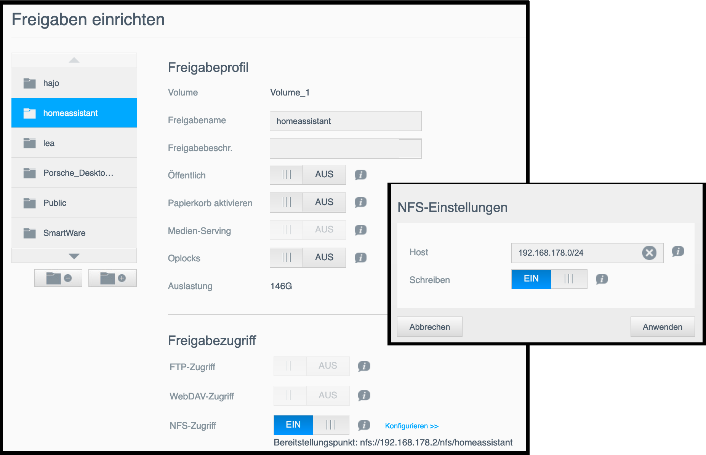

# Backup des Raspberry Pi

Ich habe mich entschlossen, gelegentlich eine komplette Sicherung der SD-Karte mit **dd** und regelmäßig eine Sicherung der sich ändernden Dateien mit **restic** durchzuführen. Die Sicherung wird auf meinem NAS gespeichert.  

## Erstellen eines Shares auf meinem NAS

  

~~Auf meinem Western Digital NAS habe ich in Anlehnung an [diese Beschreibung](https://trendblog.net/how-to-mount-your-media-server-or-nas-drive-to-a-raspberry-pi/) einen Share nur für die Backups des Raspberry Pi eingerichtet.~~ Die Freigabe wurde vom NAS bei jedem Neustart wieder entfernt.

Über die WebGUI unter **Freigaben** wählt man den gewünschten Share an, aktiviert **NFS-Zugriff** und konfiguriert die Freigabe wie gewünscht. In meinem Fall wird bei IP z.B. **192.168.178.0/24** eingegeben, um den Share im ganzen Heimnetz - aber auch nur von da - zugreifen zu können.  

### Mounten des Shares auf dem RPi

Einmalig Erstellen eines Mount-Points: `sudo mkdir /mnt/myCloud`

Mounten des Shares: `sudo mount 192.168.178.2:/nfs/homeassistant /mnt/myCloud`

Unmounten des Shares: `sudo umount /mnt/myCloud`
