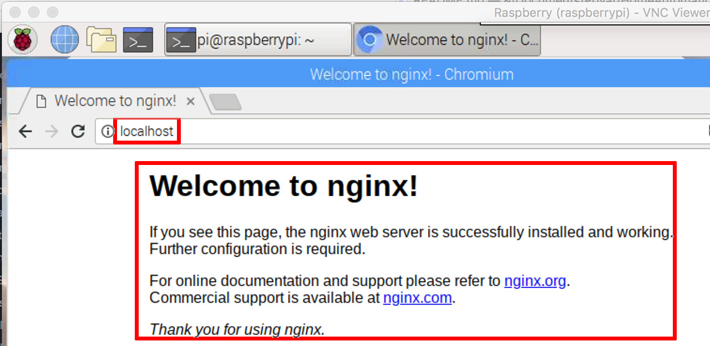

&#x1F534; **Abgelöst durch docker** &#x1F534;  
[Aktuelle Beschreibung](..//../docker/nginx.md)  

## nginx installieren
Der Webserver [nginx](https://de.wikipedia.org/wiki/Nginx) kann u.a. auch als [Reverse-Proxy](https://de.wikipedia.org/wiki/Reverse_Proxy) zur Erhöhung der Sicherheit eingesetzt werden. Eine Beschreibung zur Installation findet sich z.B. [hier](https://howtoraspberrypi.com/install-nginx-raspbian-and-accelerate-your-raspberry-web-server).  
Im November 2018 war im Raspbian-Paketrepository eine ziemlich alte nginx-Version **(v1.10)** verfügbar. Zwischenzeitlich gibt es neue Versionen, die vermeintlich schneller und sicherer seien. Ein wenig weiter [unten](#nginx-auf-aktuellere-version-bringen) habe ich die Installation der aktuellen Version beschreiben.  

### Installation aus dem Raspbian-Paketrepository
```
sudo apt install nginx php-fpm
sudo nginx
```

>**Anmerkung** Ich hatte hier beim ersten Start eine Fehlermeldung:
```
nginx: [emerg] bind() to 0.0.0.0:80 failed (98: Address already in use)
nginx: [emerg] bind() to [::]:80 failed (98: Address already in use)
```
Tat es aber trotzdem... Falls nicht:
`sudo fuser 80/tcp` zeigt die Prozesse, die auf Port 80 zugreifen und `sudo fuser -k 80/tcp` stoppt die Prozesse.

#### Warum php-fpm?
In den Paketrepositories ist nginx nicht an PHP gebunden. Bei der Entwicklung von nginx wurde die Entscheidung getroffen, PHP-FMP (eine schnellere Version von PHP) anstelle eines herkömmlicheren PHP zu verwenden. Daher werden wir php-fpm installieren, um PHP-Dateien mit nginx zu verwalten.

### Aktuellere Version von nginx installieren oder vorhandene nginx Version aktualisieren
Die aktuelle Version **(Dez 2018: v1.14.2-1)** ist nicht ganz so einfach zu installieren, da man hierfür den **testing branch** von **Raspbian** den Paketquellen hinzufügen muss. Eine Beschreibung der Installation habe ich [hier](https://getgrav.org/blog/raspberrypi-nginx-php7-dev) gefunden.

Anlegen der Datei `/etc/apt/sources.list.d/10-buster.list` mit folgendem Inhalt:  
`deb http://mirrordirector.raspbian.org/raspbian/ buster main contrib non-free rpi`

Anlegen der Datei `/etc/apt/preferences.d/10-buster` mit folgendem Inhalt:  
```
Package: *
Pin: release n=stretch
Pin-Priority: 900

Package: *
Pin: release n=buster
Pin-Priority: 750
```

Die Installation erfolgt mit den nachstehenden Kommandos. Hierbei habe ich alle Default-Werte akzeptiert.  
```shell
sudo apt-get update
sudo apt-get install -t buster nginx
```

Bei mir ist Installation nicht _glatt_ durchgelaufen; zwei der Meldungen habe ich mir zur Sicherheit [hier](./nginx_update_errors.md) aufgehoben.


### nginx starten beim booten
>**Anmerkung:** War bei mir auch ohne dies Kommando bereits autostart.

Ausführen des Kommandos:  
`sudo update-rc.d -f nginx defaults`

### nginx-Funktionaltät prüfen
Auf dem Pi im Browser `http://localhost` oder auf dem Client `http://192.168.178.111` aufrufen, um die Funktion zu überprüfen:  


### NGINX als ReverseProxy konfigurieren
([Hier](https://www.smarthomeng.de/nginx-als-reverseproxy) und [hier](https://www.home-assistant.io/docs/ecosystem/certificates/lets_encrypt) gibt es eine sehr ausführliche Beschreibung, wie man sein Home Automation durch einen Reverse Proxy mit SSL-Zertifikat (siehe [hier](https://goneuland.de/debian-9-stretch-lets-encrypt-zertifikate-mit-certbot-erstellen/)) absichern kann.  
Leider habe ich das bisher nicht hinbekommen.)

<!---
Die im Repo vorhandene Version ist recht alt (Nov 18: v0.10.2).
Daher nutze ich das Installationsskript. Darauf achten, dass Port 80 vorübergehend auf den Raspberry weitergeleitet wird (siehe [Portfreigabe](./remote.md#portfreigabe-in-fritzbox-einrichten)).
-->

#### Erstellen eines Zertifikates mit LetsEncrypt:
##### Vorbereitende Einstellungen
Vor der Erstellung des Zertifikates sind noch einige Einstellungen zu machen.

Damit `certbot:` die Identität überprüfen kann:

Mit `sudo nano /etc/nginx/snippets/letsencrypt.conf` eine Datei anlegen und folgenden Inhalt eingeben.
```
location ^~ /.well-known/acme-challenge/ {
 default_type "text/plain";
 root /var/www/letsencrypt;
}
```
Anschließend folgende Kommandos ausführen:
```
sudo mkdir -p /var/www/letsencrypt/.well-known/acme-challenge
sudo nano /etc/nginx/sites-available/default
```
Nun unterhalb von `listen [::]:80 default_server;` die Zeile `include /etc/nginx/snippets/letsencrypt.conf;` einfügen, so dass die eben erstellte Datei inkludiert wird.
```
server {
        listen 80 default_server;
        listen [::]:80 default_server;
        include /etc/nginx/snippets/letsencrypt.conf;
[...]
```
Mit `sudo service nginx restart` nginx neu starten.

##### Zertifikat erzeugen
```
cd
mkdir certbot
cd certbot/
wget https://dl.eff.org/certbot-auto
chmod u+x certbot-auto
sudo ./certbot/certbot-auto certonly --rsa-key-size 4096 --webroot -w /var/www/letsencrypt --email <myMail> -d <myDNSName>
```

Beim ersten Aufruf wird die benötigte Software installiert, bei späteren Aufrufen ggf. aktualisiert (0.29.1) und anschließend das Zertifikat herunter geladen.
Damit der LetsEncrypt-Server die angegebene Domain überprüfen kann, muss **kurzfristig** Port 80 freigegeben werden. Ist dies nicht der Fall, erhält man eine Fehlermeldung: `The server could not connect to the client to verify the domain`.

Mit dem Kommando `sudo ls -l /etc/letsencrypt/live` kann man überprüfen, dass ein Ordner mit dem Namen der eigenen dynDNS angelegt wurde.

Nun noch mit `sudo nano /etc/nginx/conf.d/<mydomain>.conf` die Konfigurationsdatei für die eigene Domäne erstellen. Hier der erste minimale Inhalt dieser Datei in Anlehnung an das oben erwähnte [Tutorial](https://www.smarthomeng.de/nginx-als-reverseproxy).

```
server {
    listen 443 ssl default_server;
    server_name <myDNSName>;

    ##
    # SSL
    ##
    ## Activate SSL, setze SERVER Zertifikat Informationen ##
    # Generiert via Let's Encrypt!
    ssl on;
    ssl_certificate /etc/letsencrypt/live/<myDNSName>/fullchain.pem;
    ssl_certificate_key /etc/letsencrypt/live/<myDNSName>/privkey.pem;
    ssl_session_cache builtin:1000 shared:SSL:10m;
    ssl_prefer_server_ciphers on;
    # unsichere SSL Ciphers deaktivieren!
    ssl_ciphers    HIGH:!aNULL:!eNULL:!LOW:!3DES:!MD5:!RC4;

    ##
    # HSTS
    ##
    add_header Strict-Transport-Security "max-age=31536000; includeSubDomains" always;

    ##
    # global
    ##
    root /var/www/<myDNSName>;
    index index.php index.htm index.html;

    # Weiterleitung von allen über https eingehenden Calls auf einen nodejs-Testserver
    location / {
        proxy_pass      http://127.0.0.1:3000;
        proxy_buffering off;
    }
}
```

Mit `sudo service nginx restart` nginx neu starten.


##### Zertifikat erneuern
Mit `sudo ./certbot/certbot-auto renew --dry-run` kann man testen, ob die automatische Erneuerung des Zertifikates funktionieren würde. Hierzu vorher Port 80 weiterleiten.   
Es fehlt noch, diese Erneuerung alle 2 Monate zu automatisieren


##### sshguard?
Wird das überhaupt benötigt, wenn man sich ohnehin nicht mit Kennwort anmelden kann?  
https://www.pilgermaske.org/2018/06/sshguard-schnell-und-einfach-ssh-absichern/

## GeoIP installieren und konfigurieren
Über GeoIP kann herausgefunden werden, aus welchem Land eine Anfrage kommt, so dass man bestimmte Länder zulassen oder blockieren kann.
```
sudo apt-get install geoip-database libgeoip1
cd /usr/share/GeoIP/
sudo wget http://geolite.maxmind.com/download/geoip/database/GeoLiteCountry/GeoIP.dat.gz
sudo gunzip GeoIP.dat.gz
```
Nun die Datei `/etc/nginx/nginx.conf` bearbeiten und direkt im „http“ Block die GeoIP Einstellungen hinzufügen:
```
    # GeoIP Settings
    # Nur Länder aus erlaubten IP Bereichen dürfen den ReverseProxy
    # passieren!
    # https://www.howtoforge.de/anleitung/nginx-besucher-mit-dem-geoip-modul-nach-landern-blocken-debianubuntu/
    ##
    geoip_country /usr/share/GeoIP/GeoIP.dat;
    map $geoip_country_code $allowed_country {
        default no;
        DE yes;
    }
```
>*Achtung:* Man kommt dann auch selbst nicht durch, wenn man sich im Ausland befindet.

Nun mit `sudo nano /etc/nginx/conf.d/<mydomain>.conf` die Konfigurationsdatei im Server-Block erweitern:
```
server {
    [...]
    ## Blocken, wenn Zugriff aus einem nicht erlaubten Land erfolgt ##
    if ($allowed_country = no) {
        return 403;
    }
    [...]
}
```
Nach dem Neustart von NGINX mit `sudo service nginx restart` ist die Änderung aktiv.

## Custom Error Pages
Um eine angepasste Seite bei Errors anzeigen zu können, muss eine entsprechende Seite erstellt und die <mydomain>.conf-Datei in der Server-Section angepasst werden.  
<mydomain>.conf:  
```
    if ($allowed_country = no) {
       return 403;
    }
    error_page 403 = @403;
    location @403 {
        root /var/www/html/;
        try_files /403.html =403;
    }
```
Hier mal ein Beispiel für 403.html - :  
```html
<!DOCTYPE html>
<html lang="en">
<head>
    <!-- Simple HttpErrorPages | MIT License | https://github.com/AndiDittrich/HttpErrorPages -->
    <meta charset="utf-8" /><meta http-equiv="X-UA-Compatible" content="IE=edge" /><meta name="viewport" content="width=device-width, initial-scale=1" />
    <title>Access Denied</title>
    <style type="text/css">/*! normalize.css v5.0.0 | MIT License | github.com/necolas/normalize.css */html{font-family:sans-serif;line-height:1.15;-ms-text-size-adjust:100%;-webkit-text-size-adjust:100%}body{margin:0}article,aside,footer,header,nav,section{display:block}h1{font-size:2em;margin:.67em 0}figcaption,figure,main{display:block}figure{margin:1em 40px}hr{box-sizing:content-box;height:0;overflow:visible}pre{font-family:monospace,monospace;font-size:1em}a{background-color:transparent;-webkit-text-decoration-skip:objects}a:active,a:hover{outline-width:0}abbr[title]{border-bottom:none;text-decoration:underline;text-decoration:underline dotted}b,strong{font-weight:inherit}b,strong{font-weight:bolder}code,kbd,samp{font-family:monospace,monospace;font-size:1em}dfn{font-style:italic}mark{background-color:#ff0;color:#000}small{font-size:80%}sub,sup{font-size:75%;line-height:0;position:relative;vertical-align:baseline}sub{bottom:-.25em}sup{top:-.5em}audio,video{display:inline-block}audio:not([controls]){display:none;height:0}img{border-style:none}svg:not(:root){overflow:hidden}button,input,optgroup,select,textarea{font-family:sans-serif;font-size:100%;line-height:1.15;margin:0}button,input{overflow:visible}button,select{text-transform:none}[type=reset],[type=submit],button,html [type=button]{-webkit-appearance:button}[type=button]::-moz-focus-inner,[type=reset]::-moz-focus-inner,[type=submit]::-moz-focus-inner,button::-moz-focus-inner{border-style:none;padding:0}[type=button]:-moz-focusring,[type=reset]:-moz-focusring,[type=submit]:-moz-focusring,button:-moz-focusring{outline:1px dotted ButtonText}fieldset{border:1px solid silver;margin:0 2px;padding:.35em .625em .75em}legend{box-sizing:border-box;color:inherit;display:table;max-width:100%;padding:0;white-space:normal}progress{display:inline-block;vertical-align:baseline}textarea{overflow:auto}[type=checkbox],[type=radio]{box-sizing:border-box;padding:0}[type=number]::-webkit-inner-spin-button,[type=number]::-webkit-outer-spin-button{height:auto}[type=search]{-webkit-appearance:textfield;outline-offset:-2px}[type=search]::-webkit-search-cancel-button,[type=search]::-webkit-search-decoration{-webkit-appearance:none}::-webkit-file-upload-button{-webkit-appearance:button;font:inherit}details,menu{display:block}summary{display:list-item}canvas{display:inline-block}template{display:none}[hidden]{display:none}/*! Simple HttpErrorPages | MIT X11 License | https://github.com/AndiDittrich/HttpErrorPages */body,html{width:100%;height:100%;background-color:#21232a}body{color:#fff;text-align:center;text-shadow:0 2px 4px rgba(0,0,0,.5);padding:0;min-height:100%;-webkit-box-shadow:inset 0 0 100px rgba(0,0,0,.8);box-shadow:inset 0 0 100px rgba(0,0,0,.8);display:table;font-family:"Open Sans",Arial,sans-serif}h1{font-family:inherit;font-weight:500;line-height:1.1;color:inherit;font-size:36px}h1 small{font-size:68%;font-weight:400;line-height:1;color:#777}a{text-decoration:none;color:#fff;font-size:inherit;border-bottom:dotted 1px #707070}.lead{color:silver;font-size:21px;line-height:1.4}.cover{display:table-cell;vertical-align:middle;padding:0 20px}footer{position:fixed;width:100%;height:40px;left:0;bottom:0;color:#a0a0a0;font-size:14px}</style>
</head>
<body>
    <div class="cover"><h1>Access Denied <small></small></h1><p class="lead"></p></div>
    <footer><p></p></footer>
</body>
</html>
```

## Weitere Maßnahmen zur Sicherung
[Hier](https://www.cyberciti.biz/tips/linux-unix-bsd-nginx-webserver-security.html) kann man einige Einstellungen zur Abwehr von bots, spammern und ähnlichem nachlesen. Es gilt die nginx-Konfigurationsdatei mit `sudo nano /etc/nginx/conf.d/<mydomain>.conf` im Server-Block zu erweitern:
```
if ($http_user_agent ~* LWP::Simple|BBBike|wget) {
    return 403;
}
if ($http_user_agent ~* msnbot|scrapbot) {
    return 403;
}
if ( $http_referer ~* (babes|forsale|girl|jewelry|love|nudit|organic|poker|porn|sex|teen) ) {
    return 403;
}
```

---

Nun ist es langsam an der Zeit, sich um [Backups](./backup.md) zu kümmern.

