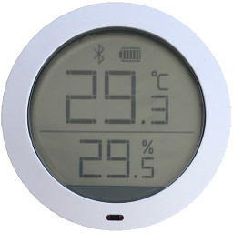
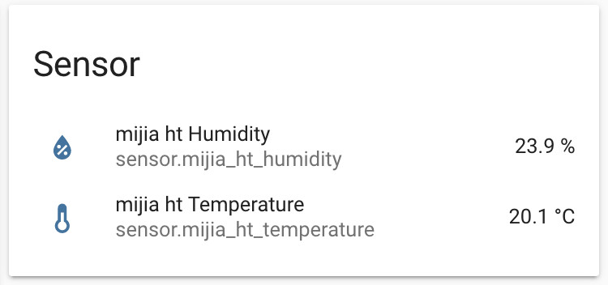

# Xiaomi Mijia BT Hygrothermo - Temperatur- und Luftfeuchtigkeitssensor

  

Die Beschreibung der Sensor-Platform findet sich [hier](https://www.home-assistant.io/components/mitemp_bt/).  
Und [hier](https://github.com/dolezsa/Xiaomi_Hygrothermo) gibt es die benötigte `sensor.py`-Datei. Diese kopiert man z.B. mit curl in das Verzeichnis `/home/pi/homeassistant/custom_components/xiaomi_hygrothermo`.  
```
curl https://github.com/dolezsa/Xiaomi_Hygrothermo/blob/master/custom_components/xiaomi_hygrothermo/sensor.py -o sensor.py
```

Wie die Mac-Adresse des Sensors bestimmt wird, wird ebenfalls in obigen Link beschrieben:
```
$ sudo hcitool lescan
LE Scan ...
[...]
71:AB:1A:xx:xx:xx (unknown)
4C:65:A8:DD:xx:xx MJ_HT_V1
[...]
```

Anschließend muss man den Sensor noch bekannt machen, indem man in die Datei `sensors.yaml` folgenden Eintrag einfügt:
```
- name: Hygrothermo_1
  mac: '4C:65:A8:DD:FF:D3'
  scan_interval: 60
  monitored_conditions:
    - temperature
    - humidity
    - battery
```

Nach dem Restart erscheinen die Sensoren:  


## Unregelmäßiger Verbindungsabbruch

Von Zeit zu Zeit verliert der RPi die Verbindung zum Sensor. Zum erneuten Verbinden muss der RPi gebootet werden. Ein Restart des Bluetooth Modems reicht nicht aus. Siehe [github issue](https://github.com/raspberrypi/linux/issues/2832).

Als temporäre Lösung wird im o.a. Issue das Kommando `sudo rpi-update` beschrieben. Hierdurch wird eine Beta-Version des Kernels eingespielt.